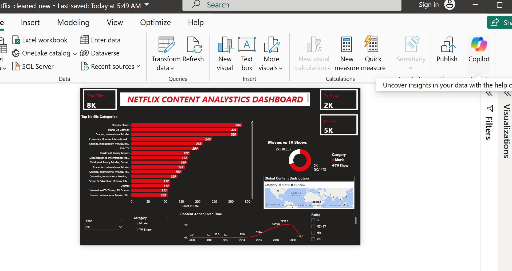
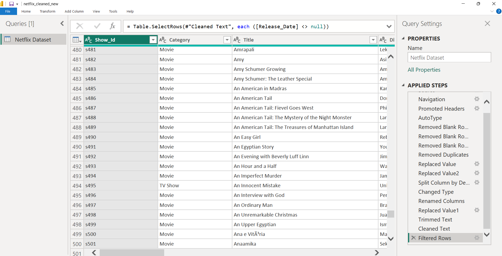

# Netflix Content Analysis Dashboard

## Project Overview

This project analyzes Netflix content using Power BI. The dashboard provides insights into content distribution, content growth over time, geographic distribution, and category-wise analysis of Movies and TV Shows.

## Dataset

* Source: Netflix Titles Dataset
* Records: ~8,000+ titles
* Features include: Title, Type, Country, Release Date, Rating, and Category.

## Tools & Technologies

* Power BI
* Power Query
* DAX
* Data Visualization

## Data Cleaning & Preparation

The dataset was cleaned and transformed using Power Query:

* Removed null values from date-related fields.
* Verified duplicate records.
* Standardized data types.
* Created derived fields for analysis.
* Prepared data for dashboard reporting.

## Dashboard Features

* KPI Cards (Total Titles, Movies, TV Shows)
* Category-wise Content Analysis
* Movies vs TV Shows Distribution
* Content Trend Analysis Over Time
* Geographic Distribution of Content
* Interactive Slicers for Filtering

## Key Insights

* Movies make up the majority of Netflix content.
* Content additions increased significantly after 2015.
* Drama and International content categories are among the most common.
* The United States and India contribute a large share of titles.

## Dashboard Preview

## Power Query Transformations

